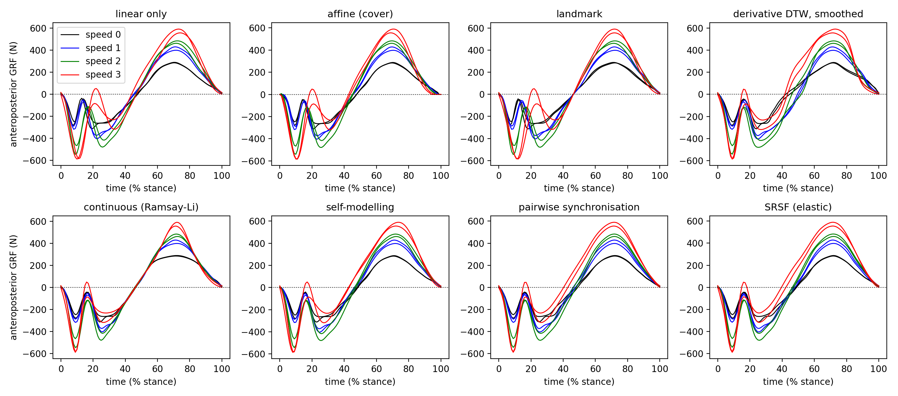

# Summary

Many measurements in the movement sciences, physiology, engineering and
economics are one-dimensional functions of time (or of another continuous
variable): ground reaction forces during a step, a joint angle over a gait
cycle, a pressure trace during a heart beat. Before such curves can be
averaged or compared, their salient features must occur at the same
position along the domain. Making that happen is *registration* (also
called curve alignment, time warping or temporal normalisation): each
observation $y_i$ is composed with a monotone *warping function*
$\gamma_i$ so that the registered curves $y_i \circ \gamma_i$ share a
common timing, while the warps themselves record the timing differences.

`reg1d` is a Python package that implements linear and nonlinear
registration of one-dimensional data behind a single, small interface. All
methods return the same result object (registered data, warps, template
and method-specific diagnostics), so that methods can be swapped and
compared with a one-word change. The package depends only on NumPy, SciPy
and Matplotlib; every algorithm is implemented from its mathematical
description rather than by wrapping another library.

# Statement of need

Registration is a standard preprocessing step in biomechanics and
functional data analysis, yet in practice it is performed with whichever
tool happens to be at hand, and the choice matters: linear
time-normalisation cannot align features that move in opposite directions,
dynamic time warping matches amplitudes rather than shapes and produces
warps with discontinuous derivatives, and elastic (square-root slope
function, SRSF) alignment can be unstable in flat, noisy regions unless
penalised. Researchers who wish to compare approaches on their own data
currently have to install several packages with incompatible conventions:
`fdasrsf` [@Tucker2013; @fdasrsf] (Cython, numba and cffi build chain),
`scikit-fda` [@Ramos2024] (a large dependency tree that itself wraps
`fdasrsf` for elastic registration), `dtw-python` [@Giorgino2009] and
`dtaidistance` [@dtaidistance] (dynamic time warping only), or the R
packages `fda` [@Ramsay2005] and `fdasrvf`. Each represents warps
differently, and none offers the downstream quantities that hypothesis
tests on timing require (centred warps, displacement fields, warps applied
to secondary variables).

`reg1d` was written to support the analysis workflow of @Pataky2022, in
which amplitude and timing effects in biomechanical trajectories are
tested separately after nonlinear registration, and to make that workflow
reproducible from a lightweight, permissively-dependent package that a
front end or a teaching environment can install without compilation. It
is aimed at applied researchers who need to register curves and then do
statistics on the result, and at methodologists who want a common footing
on which registration methods can be compared.

# State of the field

`reg1d` re-derives, rather than wraps, the main published approaches to
one-dimensional registration: linear interpolation, shift and affine
registration [@Ramsay2005]; landmark registration [@Kneip1992];
continuous (penalised least-squares) registration with smooth monotone
warps [@Ramsay1998]; self-modelling (shape-invariant model) registration
[@Kneip1988; @Gervini2004]; dynamic time warping with the standard step
patterns and window, derivative DTW [@Keogh2001] and barycentre averaging
[@Petitjean2011]; elastic registration in the SRSF framework by dynamic
programming with a Karcher-mean or -median template [@Srivastava2011;
@Tucker2013; @Srivastava2016], including vector-valued observations;
pairwise synchronisation [@Tang2008]; and Bayesian registration with
posterior samples of the warps [@Cheng2016; @Lu2017]. Where reference
implementations exist the results agree: the SRSF warps match those of
`fdasrsf` to within about 0.01 of the domain on the example data, and the
DTW paths and distances are identical to those of `dtw-python`.

Beyond assembling these methods, `reg1d` adds several pieces that the
reference packages lack and that arose from applying the methods to
biomechanical data: registration in *real time* for observations of
different lengths, so that first derivatives are compared in physical
rather than normalised time; a data-adaptive default for the SRSF
elasticity penalty (the median total variation of the observations) that
suppresses noise-driven warping in flat regions; monotonicity-preserving
smoothing of warps, which turns piecewise DTW paths into physically
plausible warps; a `cover` constraint for affine registration that keeps
the end points of force curves; a common set of warp-centring
conventions (Karcher mean, pointwise mean, event anchor or none) available
for every method; and permutation-based tests on registered data and
displacement fields that reproduce the amplitude-versus-timing analysis
of @Pataky2022.

# Software design

The package is organised around three ideas. First, a *warp* is a
first-class object: `reg1d.warp` provides application, composition,
inversion, displacement fields, Karcher means, centring, smoothing and
random generation, and every method returns its warps as a `Warp1DList`.
Second, every registration function returns a `RegistrationResult` with
the same attributes (`y`, `y0`, `warps`, `template`, `t`, `info`,
`islinear`), the methods `apply` (the same warps applied to another
variable measured on the same time base) and `unapply` (mapping
registered-time quantities back to each observation's own time), and
tuple unpacking `yr, wf = register_srsf(y)` for compatibility with
earlier scripts. Third, the numerically heavy part -- the dynamic
programme for SRSF alignment -- is vectorised over one grid axis so that
a pairwise alignment on a 101-point grid takes about 50 ms in pure NumPy,
with optional process-level parallelism over observations; no compiled
code is required, although the kernel is written so that a numba
decorator could be added later.

Trade-offs were made deliberately. Observations are assumed to be
sampled uniformly (non-uniform grids are resampled); the Bayesian sampler
uses a simplified error model whose credible intervals are known to be
optimistic and is documented as such; and the Karcher-mean centring is
applied only to invertible warps, with the pointwise mean as the default
for raw dynamic time warping paths.

# Research impact statement

`reg1d` supersedes the `nlreg1d` code released with @Pataky2022, which
wrapped `fdasrsf` and `scikit-fda`; the published analysis of that paper
(separate amplitude and timing tests on two simulated datasets and on the
running data of @Dorn2012) is reproduced in the package's notebooks with
no external registration dependency. [Add here, before submission:
preprints, theses or analyses that use `reg1d`; adoption by other groups;
integration into a front end or teaching material. JOSS requires evidence
of use beyond the authors' own work.]

# AI usage disclosure

[To be completed by the author before submission. JOSS requires a
statement naming the generative tools and versions used, where they were
used (for example code generation, test scaffolding, documentation,
drafting of this paper), and an assertion that the human author reviewed,
edited and validated all such output. Omitting or understating this is
treated by JOSS as an ethical breach.]

# Acknowledgements

The ground reaction force data were collected by @Dorn2012.

# References
